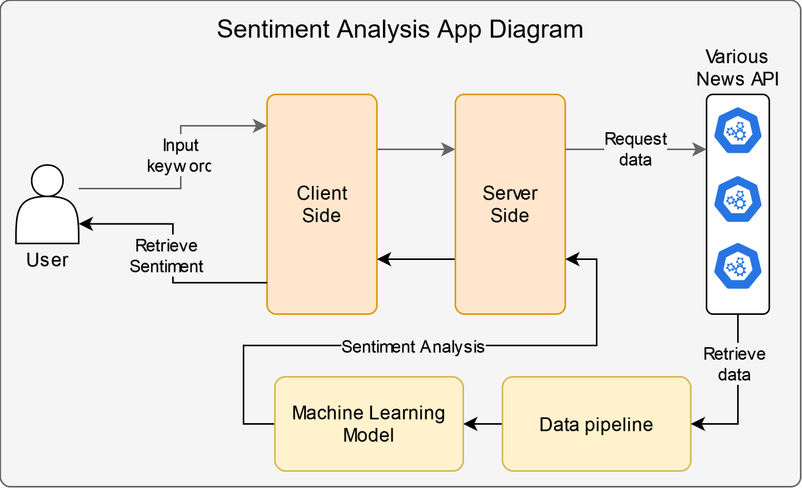

# News Sentiment Analysis App
The goal of this project is to create a news sentiment analysis app that can help the user determine the sentiment of the topic from the keyword provided by the user. The diagram is illustrated in the image below.

